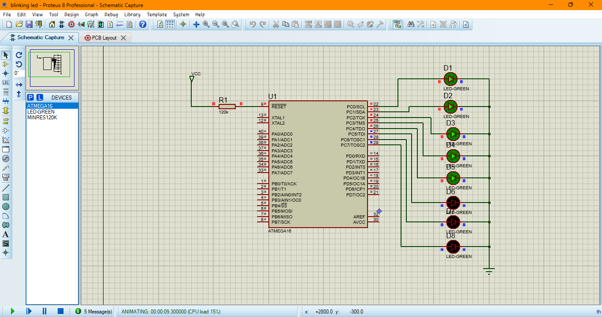

# Atmega32 Blinking LED

## Project Image
  
*Figure 1.1 The complete project setup simulated in Proteus 8.9, showing the Atmega32 microcontroller connected to an LED and other necessary components.*

## Project Components
- **Microcontroller:** Atmega32
- **Software:** Atmel Studio (for programming), Proteus 8.9 (for simulation)
- **Hardware:** LED, Resistor (330Ω), Atmega32 MCU

## Description
This project demonstrates a simple blinking LED using the **Atmega32** microcontroller. The program is written in **Atmel Studio** and simulated using **Proteus 8.9**.

## Installation & Setup
1. Open **Atmel Studio** and create a new project.
2. Write the following code to control the LED blinking.
3. Compile and upload the code to the Atmega32.
4. Simulate the circuit in **Proteus 8.9**.

## Source Code sample illustration(C)
```c
#define F_CPU 1000000UL // Set clock speed
#include <avr/io.h>
#include <util/delay.h>

int main(void) {
    DDRB |= (1 << PB0); // Set PB0 as output
    
    while (1) {
        PORTB ^= (1 << PB0); // Toggle LED state
        _delay_ms(500); // Delay for blinking
    }
}
```

## How to Run
1. Load the hex file generated in **Atmel Studio** into **Proteus 8.9**.
2. Connect the components as shown in the circuit diagram.
3. Run the simulation to observe the LED blinking.

## Expected Output
- The LED connected to **PB0** should blink at **500ms intervals**.

## License
This project is open-source and free to use for educational purposes.

## Author
**Davie**
